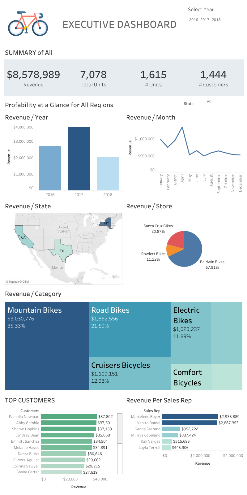

# [Portfolio](https://github.com/Lacsam/Portfolio)

# [Project 1: Movie Recommendation System Model](https://github.com/Lacsam/BikeStore-Data-visualization)

This is a project based on the included sample data to visualize different performance metrics of the bike stores in the year 2016-2018.

* Used SQL query to gather necessary data
* Includes an Excel dashboard and a Tableau visualization
* [Link to the Public Tableau](https://public.tableau.com/app/profile/lac.sam/viz/BikeStoresDashboard_16842052851400/Dashboard1)

## Picture of the Tableau Visualization
 
